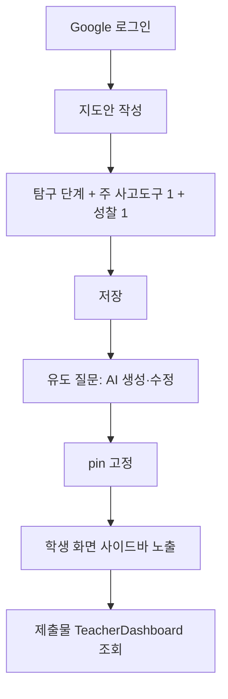

# 제품 요구사항 명세서 (PRD)

## 사고도구 톡톡 (Sagodogu Toktok)

**웹 기반 초등 과학 탐구·사고기법 학습지 플랫폼**

| 항목 | 내용 |
|------|------|
| 문서 버전 | 1.0 |
| 작성일 | 2026년 6월 |
| 대상 독자 | 석사학위논문 연구·개발 절, 교육 현장 파일럿 운영자 |
| 기술 스택 | Next.js 15, React 19, TypeScript, Tailwind CSS 4, Firebase |
| 저장소 | sagodogu-toktok |

---

## 1. 문서 목적

본 문서는 **사고도구 톡톡** 웹 애플리케이션의 제품 요구사항을 체계적으로 기술한다. 하버드 대학교 프로젝트 제로(Project Zero)의 **가시적 사고(Visible Thinking)** 루틴과 초등 과학 **개념기반 탐구** 수업 설계를 디지털 환경에 구현하기 위한 기능·비기능 요구, 사용자 역할, 데이터 구조, AI 연동 정책을 정의한다.

석사학위논문의 「연구·개발」 또는 「시스템 설계」 장에 그대로 인용·각색할 수 있도록 **교육학적 배경 → 문제 정의 → 설계 목표 → 기능 명세 → 기술 구현** 순으로 구성하였다.

---

## 2. 배경 및 문제 정의

### 2.1 교육적 배경

초등 과학 수업에서 학생의 **과학적 사고력**과 **과학 글쓰기**를 동시에 기르기 위해서는, 탐구 활동 이후 **구조화된 성찰·정리·표현** 단계가 필수적이다. Project Zero의 Visible Thinking 루틴(예: See-Think-Wonder, Claim-Support-Question, Color-Symbol-Image 등)은 관찰·추론·일반화·성찰을 촉진하는 검증된 사고 프레임워크이다.

그러나 현장에서는 다음과 같은 한계가 반복적으로 관찰된다.

1. **종이 활동지의 한계**: 차시마다 다른 양식을 인쇄·배부해야 하며, 작성물 회수·보관·피드백이 비효율적이다.
2. **사고도구 선택의 어려움**: 40여 종에 이르는 사고기법 중 **탐구 단계(질문·탐구·일반화·전이·성찰)**에 맞는 도구를 일관되게 배치하기 어렵다.
3. **과학 글쓰기 품질**: 학생이 예시 문장을 그대로 복사하거나, 짧은 감상 수준에 머무르는 경우가 많다.
4. **교사의 실시간 지원 부족**: 수업 중 학생별 **유도 질문** 제공, 제출물 일괄 열람, 동료 피드백 정리가 어렵다.

### 2.2 문제 정의

> **초등 과학 탐구 수업에서 Visible Thinking 기반 사고기법 학습지를 디지털로 제공하고, 학생의 자기주도적 글쓰기·성찰·제출과 교사의 수업 설계·모니터링·피드백을 하나의 웹 플랫폼에서 지원할 필요가 있다.**

### 2.3 제품 비전

**「탐구 단계별 사고기법 학습지를 언제 어디서나 작성하고, 과학적 사고와 글쓰기를 성장 포트폴리오로 축적하는 웹 플랫폼」**

---

## 3. 목표 및 설계 원칙

### 3.1 핵심 목표

| ID | 목표 | 측정 가능 지표(예시) |
|----|------|----------------------|
| G1 | 탐구 단계에 맞는 사고도구 학습지 제공 | 44종 템플릿, 7개 탐구 범주 분류 |
| G2 | 학생의 과학 글쓰기 품질 향상 | 항목별 최소 40자·한글 포함 검증, 예시 문구 그대로 제출 방지 |
| G3 | 교사 수업 설계·운영 지원 | 차시별 지도안, 사고도구 1+1(주+성찰) 배치, 유도 질문 관리 |
| G4 | AI 보조 피드백·질문 생성 | Gemini API, 학생 1일 1회·전체 일 100회 쿼터 |
| G5 | 학습 기록 축적 및 공유 | Firestore 제출·임시저장, 공유 링크, PDF 인쇄 |

### 3.2 설계 원칙

1. **교육 우선(Education-first)**: UI·검증 규칙은 수업 목표(과학 용어, 근거, 인과 구조)에 맞춘다.
2. **단일 소스(Single source of truth)**: 템플릿 메타데이터·필드 키·커리큘럼 순번을 코드 한곳에서 관리한다.
3. **학생 주도성**: 임시 저장, 재편집, 마이페이지 조회로 작성 흐름을 끊지 않는다.
4. **교사 통제**: Google 로그인 교사만 전체 제출·지도안·유도 질문을 관리한다.
5. **접근성·반응형**: 스마트폰·태블릿·데스크톱, 인쇄(PDF) 레이아웃 지원.
6. **최소 침습 AI**: AI는 보조(피드백·유도 질문)이며, 필수 작성은 학생이 수행한다.

---

## 4. 이해관계자 및 사용자

### 4.1 사용자 역할

| 역할 | 인증 방식 | 주요 권한 |
|------|-----------|-----------|
| **학생** | 학년·반·번호·이름 + 공통 암호(기본 `2600`) | 학습지 작성·임시저장·제출, `/my` 기록 조회, 동료 피드백(조건부), AI 피드백 1일 1회 |
| **교사** | Google OAuth | `/teacher` 전체 제출 조회·삭제, 지도안 CRUD, 유도 질문 세트 관리, 탐구보고서·동료피드백 열람 |
| **비로그인 방문자** | 없음 | 템플릿 목록 열람(제한적), 공유 링크(`/share/[token]`) 읽기 전용 |

### 4.2 페르소나

**페르소나 A — 초등 5학년 학생 (민수)**  
- 태블릿으로 수업 중 학습지에 접속한다.  
- 실험 결과를 「실험 과정·결과 기록」란에 적고, CSI(색상·기호·이미지) 루틴으로 성찰 글을 쓴다.  
- 임시 저장 후 다음 차시에 이어 쓰고, 제출하면 AI 피드백을 받는다.

**페르소나 B — 초등 과학 교사 (김 선생)**  
- Google로 로그인해 차시별 지도안에 **주 사고도구 1개 + 성찰 사고도구 1개**를 배치한다.  
- 유도 질문 4~5개를 AI로 생성·수정·고정(pin)하여 학생 화면에 노출한다.  
- 제출 현황을 일별 표로 확인하고, 탐구보고서·동료 피드백을 검토한다.

---

## 5. 교육과정·콘텐츠 체계

### 5.1 탐구 단계(5단계)와 사고도구 범주(7종)

플랫폼은 **개념기반 탐구모형**의 5단계와 Visible Thinking 도구를 다음 7개 **탐구 범주(Tool Category)**로 매핑한다.

| 범주 ID | 명칭 | 교육적 기능 |
|---------|------|-------------|
| `concept-exploration` | 개념 소개 및 탐색 | 관찰·질문·아이디어 생성 |
| `concept-formation` | 개념 형성 | 개념어 비교·연결·구조화 |
| `concept-synthesis` | 개념 종합 및 정리 | CER, 헤드라인, CSI 등 글쓰기 정리 |
| `concept-deepening` | 개념 심화 | 심화 추론·확장 |
| `feedback-support` | 피드백 지원 | 사다리형 피드백, Give 3 등 |
| `self-reflection` | 자기성찰 | 3-2-1 Bridge, I Used to Think 등 |
| `student-exchange` | 학생교류 | 토론·교환 활동 |

### 5.2 사고도구 템플릿 (44종)

홈 화면(`/`) 및 `/templates/[id]`에서 제공하는 학습지 템플릿은 **44종**이며, 각 템플릿은 다음 메타정보를 갖는다.

- 국문·영문 명칭, 탐구 범주, 범주 내 순번, 전역 순번
- 사고 특성(유창성·융통성·독창성·정교성) — 해당 시 표시
- AI 기능 설명(라벨·상세)
- 헤더 필드 구성(`unit`, `period`, `inquiryQuestion`, `writingContext` 등)
- 제출 검증용 value 필드 키

**대표 템플릿 예시 (용해와 용액 단원 연계)**

| 템플릿 | ID | 용도 |
|--------|-----|------|
| Generate-Sort-Connect-Elaborate | `gsce` | 아이디어 생성·분류·연결·정교화 |
| Claim, Support, Question | `claim-support-question` | CER 구조 과학 글쓰기 |
| Headline | `headline` | 일상 속 용액 가치 헤드라인 작성 |
| Color, Symbol, Image | `color-symbol-image` | CSI 창의 성찰 글쓰기 |
| See, Think, Wonder | `see-think-wonder` | 관찰·생각·궁금증 |
| Think, Puzzle, Explore | `think-puzzle-explore` | 사전 지식·수수께끼·탐색 계획 |

### 5.3 차시별 지도안과 사고도구 배치 규칙

교사용 **지도안(Lesson Plan)** 모듈(`/teacher/lesson-plans`)은 다음 규칙을 강제한다.

- **주 탐구 단계** 1개 선택: 질문하기 / 탐구하기 / 일반화하기 / 전이하기
- 해당 단계에 허용된 범주에서 **주 사고도구 1개** 필수 선택
- **성찰하기** 옵션 시 **성찰 사고도구 1개** 추가(주 도구와 중복 불가)
- 지도안 필드: 단원·차시·핵심 아이디어·성취기준·탐구 지식·과정·가치·평가·수업 전개 표 등

### 5.4 Standalone HTML 학습지

네트워크·로그인 없이 수업 후반 10분 **독립 창의 글쓰기**에 사용할 **단일 HTML 파일** 4종을 `public/`에 제공한다.

| 파일 | 대응 루틴 |
|------|-----------|
| `gsce-worksheet.html` | G-S-C-E |
| `csq-solution-concentration.html` | CSQ (용액 진하기) |
| `headlines-daily-solutions.html` | Headlines |
| `csi-solution-daily.html` | CSI (용해와 용액) |

공통 기능: Tailwind CDN, localStorage 자동·수동 저장, `@media print` A4 인쇄, 셀프 체크리스트.

---

## 6. 기능 요구사항

### 6.1 기능 목록 요약

| ID | 기능 | 우선순위 | 사용자 |
|----|------|----------|--------|
| F-01 | 학생 로그인·프로필 | 필수 | 학생 |
| F-02 | 사고도구 템플릿 목록·상세 | 필수 | 전체 |
| F-03 | 학습지 작성·임시저장·제출 | 필수 | 학생 |
| F-04 | 입력 검증·예시 문구 방지 | 필수 | 학생 |
| F-05 | 공통 마무리(한 줄 결론·셀프 체크) | 필수 | 학생 |
| F-06 | PDF 인쇄 | 필수 | 학생·교사 |
| F-07 | AI 피드백(제출 시) | 높음 | 학생 |
| F-08 | 교사 대시보드(제출 조회) | 필수 | 교사 |
| F-09 | 지도안 관리 | 높음 | 교사 |
| F-10 | 유도 질문 관리·학생 노출 | 높음 | 교사·학생 |
| F-11 | 탐구보고서 작성·제출 | 높음 | 학생 |
| F-12 | 동료 피드백 | 중간 | 학생 |
| F-13 | 공유 링크(읽기 전용) | 중간 | 학생 |
| F-14 | 마이페이지 | 필수 | 학생 |
| F-15 | 학습지 사용/미사용 현황 | 중간 | 학생 |
| F-16 | 클립보드 복사·붙여넣기 차단 | 중간 | 학생 |

---

### 6.2 F-01 학생 인증

**요구사항**

- 입력: 학년, 반, 번호, 이름, 암호
- Firebase Auth 이메일/비밀번호: `{grade}-{classNo}-{studentNo}@sagodogu-student.app`
- 최초 로그인 시 계정 자동 생성, `students/{uid}` 프로필 저장
- 교사 메뉴(`/teacher/*`)는 학생 역할에서 숨김 및 접근 차단

---

### 6.3 F-02 ~ F-03 학습지 작성 흐름

**화면 구성 (`WorksheetViewer`)**

1. **헤더(WorksheetHeader)**: 학년·반·번호·이름, 단원·차시, 탐구질문, **「실험 과정·결과 기록」**(`writingContext`)
2. **안내 배너**: 최소 글자수, 임시 저장 안내, AI 쿼터
3. **템플릿 본문(TemplateRenderer)**: 루틴별 React 컴포넌트
4. **공통 마무리(WorksheetClosingSection)**: 최종 한 줄 결론 + 셀프 체크 3항
5. **동료 피드백(PeerFeedbackSection)**: 해당 템플릿·조건 충족 시
6. **액션 바**: 임시 저장, 제출, 수정, PDF 인쇄

**임시 저장**

- Firestore `submissions` 컬렉션, `status: "draft"`
- 동일 학생·템플릿에 대해 기존 draft 갱신

**제출**

- 검증 통과 후 `status: "submitted"`, `submittedAt` 기록
- AI 쿼터 가용 시 Gemini 피드백·등급 동시 저장

---

### 6.4 F-04 입력 검증

| 규칙 | 상세 |
|------|------|
| 최소 글자수 | 일반 학습지 항목 **40자 이상** |
| 한글 포함 | `hasKorean()` — 완성형 한글 1자 이상 |
| 예시 문구 방지 | `example-texts.ts` 등록 문구와 동일 입력 시 제출 거부 |
| 마무리 한 줄 결론 | `closingHeadline` 40자 이상 (Headline 템플릿은 본문에 제목 필드가 있어 결론란 생략) |
| 셀프 체크 | `closingCheckTerms`, `closingCheckEvidence`, `closingCheckCausal` 체크 필수 |
| 동료 피드백 | 항목당 40자 이상 한글 (`MIN_FEEDBACK_FIELD_CHARS`) |

**검증 제외**: 체크박스 값, 빈 선택 필드는 별도 규칙 적용.

---

### 6.5 F-05 공통 마무리 영역

모든 학습지 하단에 자동 렌더링.

**한 줄 결론** (`closingHeadline`)  
- placeholder 예: 「용액은 일정한 성질을 유지하므로 우리 생활에서 믿고 쓸 수 있다.」

**셀프 체크 3항**

1. 핵심 과학 용어를 정확하게 사용했는가?
2. 생각·주장과 구체적 근거·데이터를 포함했는가?
3. 문장이 논리적 인과 관계로 끝나는가?

---

### 6.6 F-07 AI 피드백

**API**: `POST /api/feedback`  
**모델**: Google Gemini (환경변수 `GEMINI_API_KEY`)

**입력**: 템플릿명, 메타(주제 등), values(최대 30필드×300자 요약)  
**출력 JSON**: `{ rating: "잘함"|"보통"|"노력요함", feedback: string }` (피드백 최대 200자)

**쿼터 정책**

| 구분 | 한도 |
|------|------|
| 학생 1인/일 | 1회 |
| 전체/일 | 100회 (환경변수 `GEMINI_DAILY_LIMIT`) |

쿼터 초과 시 **제출은 허용**, AI 피드백만 생략.

**상태 조회**: `GET /api/ai-status?studentUid=...`

---

### 6.7 F-09 ~ F-10 지도안·유도 질문

**유도 질문(Guided Questions)**

- 교사: `/teacher/guided-questions`에서 템플릿·주제·단원·학년·실험 기록 맥락 입력
- AI 생성: `POST /api/guided-questions` — 초등 수준 4~5문항, 40자 이내 권장
- Firestore 저장, `pinned: true` 시 학생 화면 **우측 사이드바**에 노출
- 학생 답변은 `guided_q_0` … `guided_q_4` 필드에 저장

---

### 6.8 F-11 탐구보고서

**경로**: `/inquiry-report`

**섹션(11+)**: 궁금한 내용, 탐구 문제, 알고 있는 것, 탐구 과정(5단계), 결과, 알게 된 점, 더 알고 싶은 점, 배운 내용, 시각화(캔버스 그림 + 설명) 등

**교사 열람**: `TeacherInquiryReports` 컴포넌트

---

### 6.9 F-12 동료 피드back

**대상**: 같은 반 제출 완료 학습지 또는 탐구보고서  
**항목**: 나와 다른 점, 잘한 점, 궁금한 점  
**제한**: 학생당 최대 2건 (`MAX_PEER_FEEDBACK_COUNT`)  
**교사 열람**: `TeacherPeerFeedbacks`

---

### 6.10 F-13 공유

- 제출 후 **공유 링크 복사** → `/share/[token]` 읽기 전용 뷰
- Firestore `shares` 컬렉션에 토큰 매핑

---

### 6.11 F-16 학습 무결성(클립보드 가드)

학생 역할 로그인 시 `StudentClipboardGuard`가 **복사·붙여넣기·잘라내기·텍스트 드래그**를 차단하여, 외부 예시 문장 붙여넣기를 억제한다. (예시 문구 검증과 이중 방어)

---

## 7. 비기능 요구사항

### 7.1 성능·가용성

- 정적 템플릿 페이지 SSG (`generateStaticParams`, 57 routes)
- Firebase 클라이언트 SDK — 오프라인 persistence 미필수, 온라인 제출 중심
- Vercel 배포, Node.js 20.9+

### 7.2 보안·개인정보

- 학생: 가명 이메일(slug), 공통 교실 암호 — **교실 수준 보안 모델**
- 교사: Google OAuth + Firestore `teachers/{uid}` 화이트리스트
- Firestore Security Rules 별도 배포 (`npm run deploy:firestore`)
- API 키(Gemini, Firebase Admin)는 서버 환경변수 only

### 7.3 UI/UX

- Tailwind CSS 4, Noto Sans KR
- 모바일 우선 반응형 그리드
- 인쇄 시 버튼·URL 숨김, `#worksheet-print` 영역 A4 최적화
- 초등·중등 교육 환경: 파스텔톤, scannable 레이아웃, 불필요 이모지 배제

### 7.4 접근성·국제화

- `lang="ko"`, 한국어 UI 전면
- 향후 다국어는 범위 외(v1.0)

---

## 8. 시스템 아키텍처

### 8.1 계층 구조

```
[Browser]
   ├── Next.js App Router (React 19 Client Components)
   │     ├── /templates/[id]  — WorksheetViewer
   │     ├── /teacher/*       — TeacherDashboard, LessonPlan, GuidedQuestions
   │     ├── /inquiry-report  — InquiryReportEditor
   │     └── /api/*           — feedback, guided-questions, ai-status
   │
   ├── Firebase Client (Auth, Firestore)
   └── public/*.html          — Standalone worksheets

[Server]
   ├── Firebase Admin SDK     — quota, server-side ops
   └── Gemini API             — AI feedback & guided questions
```

### 8.2 주요 Firestore 컬렉션

| 컬렉션 | 용도 |
|--------|------|
| `students/{uid}` | 학생 프로필 |
| `teachers/{uid}` | 교사 등록 |
| `submissions/{id}` | 학습지 draft/submitted |
| `inquiryReports/{id}` | 탐구보고서 |
| `peerFeedbacks/{id}` | 동료 피드백 |
| `lessonPlans/{id}` | 차시 지도안 |
| `guidedQuestionSets/{id}` | 유도 질문 세트 |
| `shares/{token}` | 공유 링크 |
| `apiQuota/{date}` | AI 일별 사용량 |

### 8.3 핵심 모듈 매핑

| 모듈 경로 | 책임 |
|-----------|------|
| `src/lib/templates/registry.ts` | 44종 템플릿 정의 |
| `src/lib/templates/field-keys.ts` | 제출 검증 필드 키 |
| `src/lib/templates/example-texts.ts` | 예시·placeholder·제출 방지 |
| `src/lib/worksheet-validation.ts` | 글자수·한글 검증 |
| `src/lib/worksheet-closing/` | 공통 마무리 상수 |
| `src/components/templates/*` | 루틴별 UI |
| `src/hooks/useWorksheetDraft.ts` | 임시 저장 |
| `src/hooks/useWorksheetSubmit.ts` | 제출 + AI |
| `src/lib/lesson-plan/` | 지도안·사고도구 매핑 |

---

## 9. 사용자 시나리오 (User Flow)

### 9.1 학생 — CSI 학습지 작성·제출

```mermaid
flowchart TD
    A[로그인] --> B[홈: 템플릿 선택]
    B --> C[/templates/color-symbol-image]
    C --> D[헤더: 실험 과정·결과 기록]
    D --> E[CSI 3영역 작성]
    E --> F[공통 마무리: 한 줄 결론 + 체크]
    F --> G{40자+ 한글?}
    G -->|No| H[오류 메시지]
    G -->|Yes| I[제출]
    I --> J[AI 피드백 1회]
    J --> K[/my 기록 확인]
```

### 9.2 교사 — 차시 설계·유도 질문



---

## 10. 화면별 IA (Information Architecture)

| 경로 | 설명 |
|------|------|
| `/` | 홈: 탐구보고서入口, 사고도구 그리드(7범주) |
| `/login` | 학생·교사 로그인 |
| `/templates/[id]` | 학습지 작성 |
| `/my` | 내 제출·탐구보고서 |
| `/inquiry-report` | 탐구보고서 편집기 |
| `/teacher` | 교사 대시보드 |
| `/teacher/lesson-plans` | 지도안 관리 |
| `/teacher/guided-questions` | 유도 질문 관리 |
| `/share/[token]` | 공유 읽기 전용 |

---

## 11. 데이터 모델 (요약)

### 11.1 WorksheetSubmission

```typescript
{
  templateId: string;
  templateName: string;
  meta: WorksheetMeta;      // grade, classNo, studentNo, studentName, unit, period, ...
  values: Record<string, string>;
  studentUid: string;
  status: "draft" | "submitted";
  submittedAt: Timestamp | null;
  aiFeedback?: string;
  aiRating?: "잘함" | "보통" | "노력요함";
}
```

### 11.2 WorksheetMeta (공통 헤더)

| 필드 | 라벨(UI) |
|------|----------|
| `writingContext` | 실험 과정·결과 기록 |
| `unit` | 단원 |
| `period` | 차시 |
| `inquiryQuestion` | 탐구질문 |

---

## 12. 논문 연구·평가 연계 항목

본 PRD를 논문에 반영할 때, 다음 항목을 **연구 설계·평가 도구**와 연결할 수 있다.

1. **독립변수**: 디지털 사고도구 학습지 사용(44종 중 차시 배치 도구)
2. **종속변수**: 과학 글쓰기 품질(용어 정확성, 근거 포함, 인과 구조) — 셀프 체크·루브릭
3. **과정 데이터**: Firestore 제출 timestamp, draft→submit 간격, AI rating 분포
4. **교사 설계**: 지도안의 thinkingTool·reflectionThinkingTool 선택 패턴
5. **한계**: 공통 교실 암호, AI 1일 1회, 클립보드 차단의 현장 수용성

---

## 13. 범위 및 향후 과제

### 13.1 v1.0 포함 범위

- 44종 React 템플릿 + 4종 standalone HTML
- 학생/교사 이원 인증, 제출·피드백·지도안·유도질문
- AI 피드백·질문 생성(Gemini)
- PDF 인쇄, 공유 링크

### 13.2 v1.0 범위 외 (Backlog)

- Chalk Talk 실시간 협업 보드(현재 AI 설명만 등록)
- Zoom In 단계적 이미지 확대(미구현 AI 기능)
- 4C's(The 4 C's) 활동지 상세 구조 개편
- LMS(Schoology 등) LTI 연동
- 오프라인 PWA·Firestore offline persistence

---

## 14. 용어 정의

| 용어 | 정의 |
|------|------|
| **사고도구** | Visible Thinking 루틴 등 구조화된 사고·글쓰기 프레임워크 |
| **학습지** | 특정 사고도구에 대응하는 디지털 입력 양식 |
| **탐구 범주** | 7단계 교육과정 분류(탐색~교류) |
| **실험 과정·결과 기록** | `writingContext` — 당일 실험·관찰 데이터 기록란 |
| **공통 마무리** | 모든 학습지 하단 한 줄 결론 + 메타인지 셀프 체크 |
| **CSI** | Color, Symbol, Image — 색상·기호·이미지 창의 성찰 루틴 |
| **CSQ** | Claim, Support, Question — CER 글쓰기 |
| **G-S-C-E** | Generate, Sort, Connect, Elaborate |

---

## 15. 개정 이력

| 버전 | 일자 | 변경 내용 |
|------|------|-----------|
| 1.0 | 2026-06 | 최초 작성 — 코드베이스 main(7f11a58) 기준 반영: CSI 학습지, 공통 마무리, 40자 검증, PDF 출력 |

---

## 부록 A. 환경 변수

| 변수 | 용도 |
|------|------|
| `NEXT_PUBLIC_FIREBASE_*` | 클라이언트 Firebase |
| `FIREBASE_SERVICE_ACCOUNT` / JSON 파일 | Admin SDK |
| `GEMINI_API_KEY` | AI 피드백·유도 질문 |
| `GEMINI_DAILY_LIMIT` | 전체 일일 AI 한도(기본 100) |
| `NEXT_PUBLIC_STUDENT_PASSWORD` | 학생 로그인 암호(기본 2600) |

---

## 부록 B. 논문 인용 예시 (각주용)

> 본 연구에서 개발한 「사고도구 톡톡」은 Project Zero의 Visible Thinking 루틴 44종을 웹 학습지로 구현하고, 개념기반 탐구 5단계에 따른 사고도구 배치·유도 질문·AI 보조 피드백·과학 글쓰기 검증(40자 이상, 한글, 예시 문구 방지) 기능을 통합한 초등 과학 디지털 학습 환경이다(제품 요구사항 명세서 v1.0, 2026).

---

*본 문서는 sagodogu-toktok 저장소의 구현 상태를 기반으로 작성되었으며, 논문 본문에 편입 시 연구 맥락에 맞게 각색할 수 있다.*
